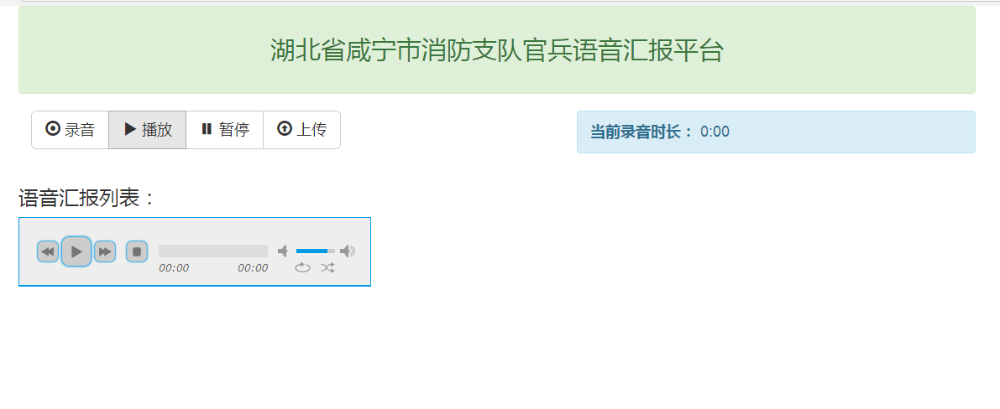

# 网页在线录音并上传

前段时间接了一个外包项目，有一个功能是网页在线录音并上传云服务器的需求，之前没有接触过，想着Google了一下找个demo改改；
找到三个，基本能满足需求：

* [https://github.com/uikoo9/recorder-online-upload](https://github.com/uikoo9/recorder-online-upload)
* [https://github.com/michalstocki/FlashWavRecorder](https://github.com/michalstocki/FlashWavRecorder)
* [https://github.com/mattdiamond/Recorderjs](https://github.com/mattdiamond/Recorderjs)

第一个是在第二个的基础上扩展出来的，使用flash模块实现录音功能；第一个已经实现了录音并上传到服务器的功能，但是有个问题是录音中杂音太大，鉴于自身技术水平不支持优化源码，所以基本是被嫌弃了；
第三个是使用 HTML5 的 Audio API 实现的，如果不考虑 ie 的话，是非常推荐的；

以上是对三个录音插件的简单说明，我的需求是能够兼容低版本浏览器，实现录音后上传服务器并获取音频地址；

经过一番 Google，算是找到一个满足需求的：[https://github.com/jwagener-soundcloud/recorder.js](https://github.com/jwagener-soundcloud/recorder.js)
这个插件基于 swfObject.js，使用 flash 实现录音功能，同时它还封装好了上传功能，支持上传到服务器和 SoundCloud；

recorder.js 源码，集成了swfObject.js，封装了初始化、录音开始、录音停止、录音播放、录音上传等方法；插件有提供 demo，基本用法可以参考 demo 了解使用，就不多说了；

###### 废话这么多，说一下我的需求：
* 网页在线录音，并上传到服务器；
* 录音开始，同时执行倒计时（倒计时结束录音结束）；
* 录音结束，上传录音；
* 上传录音完成，执行方法进入下一个录音场景；
* 所有录音场景结束，展示录音列表并播放；
* 兼容低版本浏览器；
所有录音场景结束之后，对 recordArr 数组遍历输出，并插入到结果展示页中；
至于音频播放，那是播放器的事，项目中用到的是 [jplayer 中文网](http://www.jplayer.org/)播放器；

